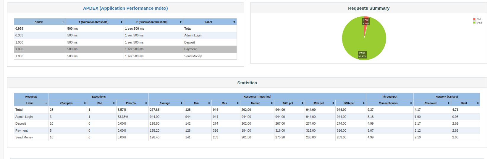

# jmeter-api-chaining

## How to run
- Clone this project using `git clone https://github.com/prianka97/jmeter-api-chaining.git`
- import Dmoney.jmx into jmeter

## Prerequisite
- Install Jmeter

## Technology 
- Jmeter
## Jmeter Dmoney api collection test

